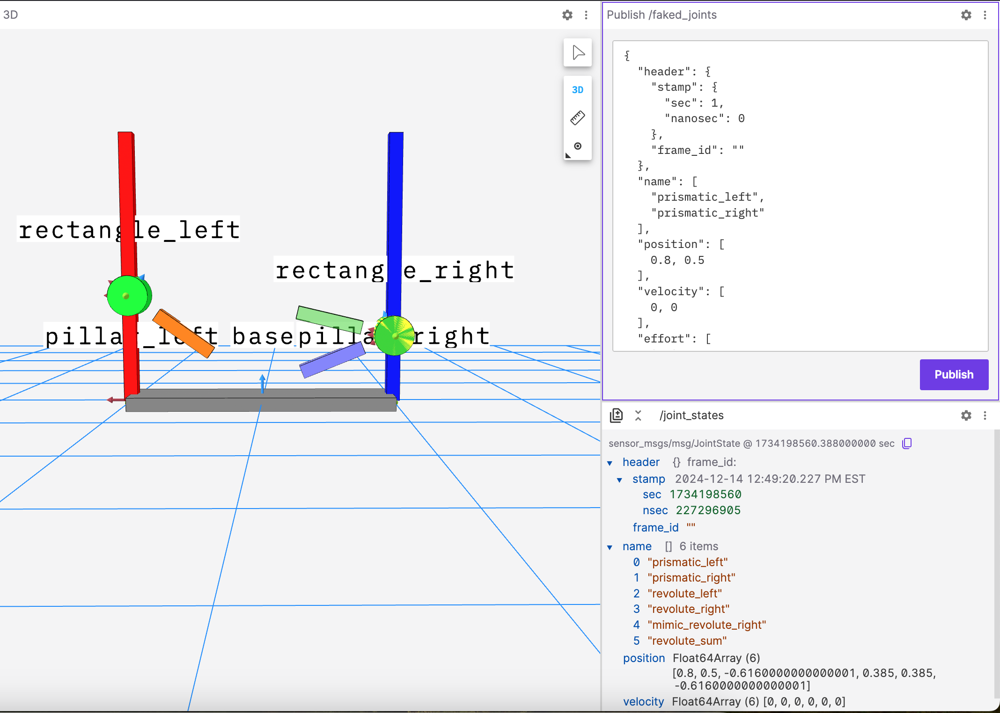

# Testing URDF

Created a devcontainer for my macOs to test a URDF without needing to explicitely install ROS2.

## Examples

### Both Axes are set to 0 meters

### Right is Higher

### Both Axes are set to 0.5 meters

### Left is Higher

<!--
## Allowing X11 forwarding on mac (NOT NECESSARY with Foxglove)

https://gist.github.com/devnoname120/ce02ef43da968e15340427c2f1c286a7

- Need to `open -a XQuartz` before running in order for forwarding to occur -->
